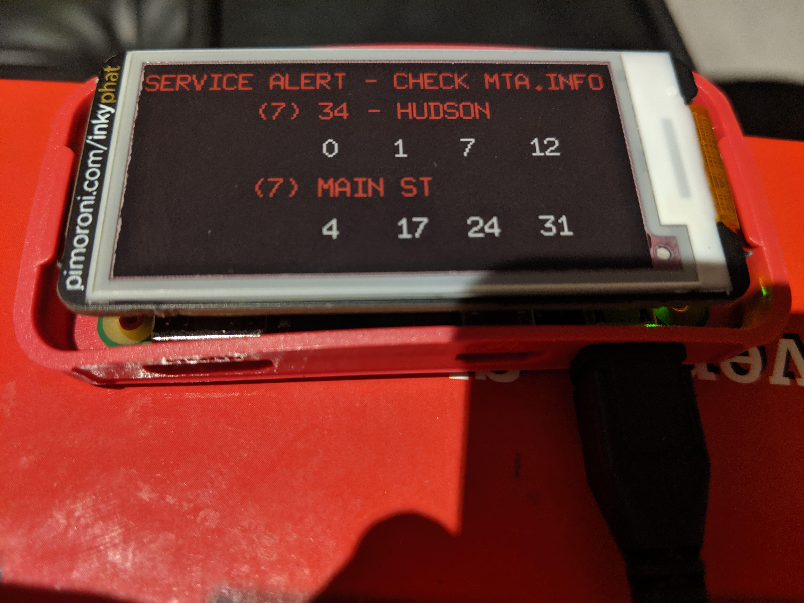

# Subwayclock

Subwayclock is a simple program used to power a Raspberry PI-based countdown
clock. The display is similar to the countdown clocks that can be seen on the
New York Subway platform.

# Requirements

In order to use this library, you'll need the following:

1. An MTA API key. You can register for an account at: http://datamine.mta.info/
2. A Raspberry PI. I have personally tested this on a Raspberry PI Zero W, but other models should work.
3. An [Inky pHAT](https://shop.pimoroni.com/products/inky-phat) display.

# Usage

1. Clone this repo. `git clone git@github.com:ztstewart/subwayclock.git`.
2. Modify `main.go` to use the correct stop ID for your home station and change the labels for your train line.
3. Add your MTA API Key in the `client.NewNYCTA(&client.Config{....})` line.
4. Compile the tool: `go build`. You can compile for the Raspberry Pi a more powerful machine: `GOOS=linux GOARCH=arm GOARM=5 go build`
5. (Optional) If you cross compiled (that is, compiled on another machine), copy the binary to your Raspberry Pi.
6. Run the binary: `./subwayclock`. It will continuosly update its information every minute by default.
